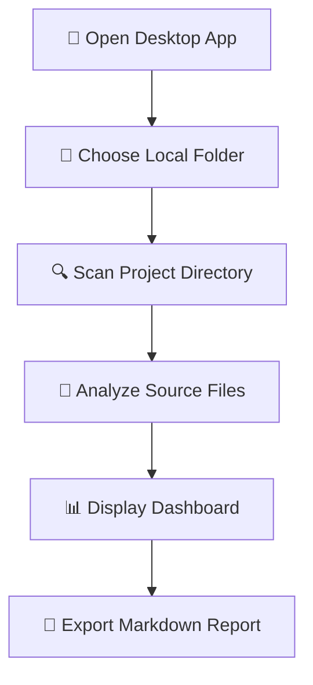
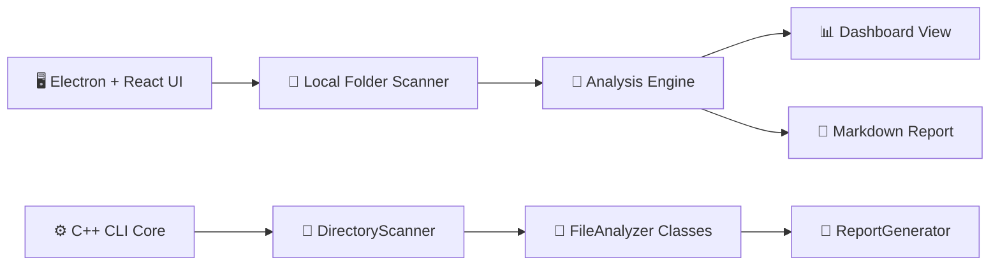
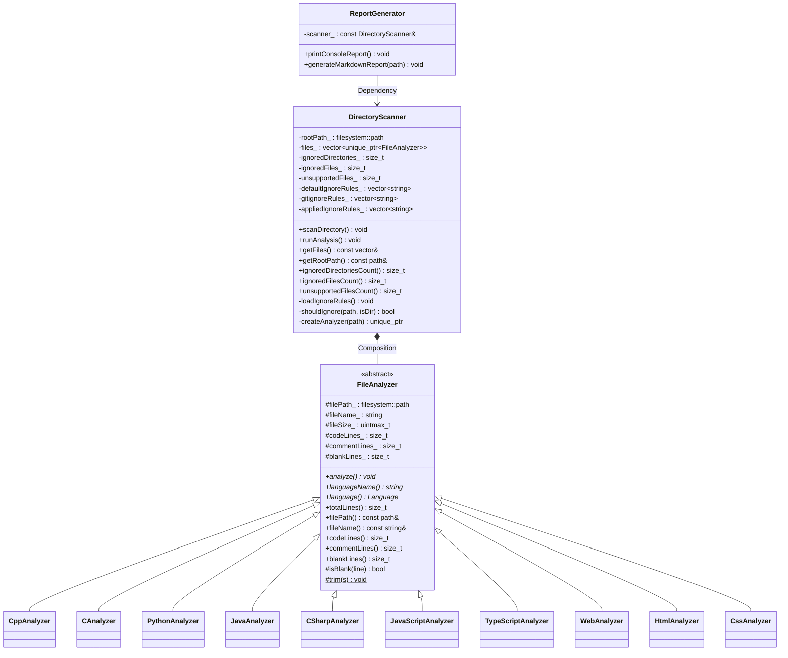

<div align="center">

# 🧠 Codebase Analyzer

### ⚡ Local Source Code Analyzer with Desktop UI & C++ OOP Core

<p>
  
  
  
  
  
</p>

<p>
  <b>Scan local source folders, inspect language usage, count real code/comment/blank lines, and export reproducible reports.</b>
</p>

<p>
  <a href="https://github.com/ThanhNguyn/Codebase-Analyzer/releases/latest">📦 Download Latest Release</a>
  ·
  <a href="https://thanhnguyn.github.io/Codebase-Analyzer-docs/">📖 Web Documentation</a>
  ·
  <a href="https://github.com/ThanhNguyn/Codebase-Analyzer-docs">📂 Docs Repository</a>
  ·
  <a href="#-getting-started">🚀 Getting Started</a>
</p>


</div>

---

## 📌 Overview

**Codebase Analyzer** is an Object-Oriented Programming project designed to analyze local source code repositories.

The project includes:

- ⚙️ A **C++23 CLI analyzer core** built with OOP architecture
- 🖥️ A **desktop UI prototype** built with Electron, React, TypeScript, and Vite
- 📝 A Markdown report workflow for storing analysis results
- 🤖 GitHub Actions workflow support for cross-platform release builds

The application helps users quickly understand the structure and scale of a codebase without manually opening every file.

---

## ✨ Key Features

| Feature | Description |
|---|---|
| 📂 **Local Folder Selection** | Choose a real local project folder before analysis starts |
| 🔍 **Recursive Directory Scanning** | Traverse nested folders and detect valid source files automatically |
| 🚫 **Noise Folder Filtering** | Ignore folders such as `.git`, `build`, `release`, `node_modules`, `dist`, `venv`, and generated outputs |
| 🧠 **Language-aware Analysis** | Detect files by extension and apply language-specific parsing rules |
| 💬 **Comment Detection** | Count single-line and multi-line comments depending on syntax |
| ⬜ **Blank Line Detection** | Separate blank lines from executable code |
| 📊 **Desktop Dashboard** | Display analysis results through a modern local UI |
| 📝 **Markdown Report Export** | Generate `codebase_report.md` for documentation or submission |
| 🧩 **OOP Architecture** | Demonstrate abstraction, inheritance, polymorphism, and encapsulation |

---

## 📦 Download & Installation

You can use **Codebase Analyzer** in two ways:

| Mode | Best for | Interface |
|---|---|---|
| 🖥️ **Desktop UI App** | Normal users, demos, presentations | Visual desktop app |
| ⚙️ **CLI Mode** | Developers, terminal usage, C++ core testing | Command line |

---

## 🖥️ Option 1 — Use Desktop UI App

### ✅ Recommended for

- Presenting the project in class
- Selecting folders visually
- Viewing analysis results in a dashboard-style interface
- Using the application without typing CLI commands

### ⬇️ Download

Download the latest desktop build here:

👉 **[Download Latest Release](https://github.com/ThanhNguyn/Codebase-Analyzer/releases/latest)**

You can also view all published versions here:

👉 **[All Releases](https://github.com/ThanhNguyn/Codebase-Analyzer/releases)**

---

### 🪟 Windows Installation

1. Open the **Latest Release** page:

```txt
https://github.com/ThanhNguyn/Codebase-Analyzer/releases/latest
```

2. Download the Windows build. The file name may look like one of these:

```txt
Codebase-Analyzer-Setup.exe
```

or:

```txt
Codebase-Analyzer-win-unpacked.zip
```

3. If you downloaded the installer:

```txt
Double-click the .exe file → follow the installer steps → open Codebase Analyzer
```

4. If you downloaded the ZIP version:

```txt
Extract the ZIP file → open the extracted folder → run Codebase Analyzer.exe
```

5. In the app, click:

```txt
Choose Local Folder
```

6. Select the project folder you want to analyze.

7. View results in the desktop dashboard and export the report if needed.

---

### 🐧 Linux Installation

Linux builds may be available through the release page or GitHub Actions artifacts.

1. Open:

```txt
https://github.com/ThanhNguyn/Codebase-Analyzer/releases/latest
```

2. Download the Linux artifact if available, for example:

```txt
Codebase-Analyzer.AppImage
```

3. Give it execution permission:

```bash
chmod +x Codebase-Analyzer.AppImage
```

4. Run it:

```bash
./Codebase-Analyzer.AppImage
```

> ⚠️ Linux builds are generated automatically when configured in GitHub Actions. Runtime behavior should be verified on an actual Linux machine.

---

### 🍎 macOS Installation

macOS builds may be available through the release page or GitHub Actions artifacts.

1. Open:

```txt
https://github.com/ThanhNguyn/Codebase-Analyzer/releases/latest
```

2. Download the macOS build if available, for example:

```txt
Codebase-Analyzer.dmg
```

3. Open the `.dmg` file.

4. Drag the application into the `Applications` folder.

5. Launch the app and choose a local folder to analyze.

> ⚠️ macOS Gatekeeper may warn about unsigned applications. This is normal for student projects without a paid Apple Developer signing certificate.

---

### 📌 Desktop UI Notes

- The app requires the user to choose a real local folder before analysis.
- It does not automatically analyze a bundled sample project.
- The UI is designed for local static code analysis and project presentation.
- Windows is the primary manually tested platform.

---

## ⚙️ Option 2 — Use CLI Mode Without UI

### ✅ Recommended for

- Demonstrating the C++ OOP analyzer core
- Terminal-based analysis
- Lightweight testing
- Debugging analyzer logic
- Running without Electron/React UI

---

### 🛠️ Requirements

Make sure these tools are installed:

- 🧩 Git
- ⚙️ CMake `3.20+`
- 🧠 C++ compiler with C++23 support

Examples:

| OS | Recommended compiler |
|---|---|
| 🪟 Windows | MSVC / MinGW |
| 🐧 Linux | GCC / Clang |
| 🍎 macOS | Apple Clang |

---

### 📥 Clone Repository

```bash
git clone https://github.com/ThanhNguyn/Codebase-Analyzer.git
cd Codebase-Analyzer
```

---

### 🧱 Build CLI Core

```bash
cmake -S . -B build
cmake --build build
```

---

### ▶️ Run CLI Analyzer

Analyze the current folder:

```bash
./build/codebase-analyzer .
```

Analyze a specific folder:

```bash
./build/codebase-analyzer path/to/your/project
```

On Windows, the executable may be inside `Debug` or `Release` depending on your generator:

```powershell
.\build\Debug\codebase-analyzer.exe .
```

or:

```powershell
.\build\Release\codebase-analyzer.exe .
```

---

### 📝 CLI Output

After running the CLI analyzer, the project generates a Markdown report:

```txt
codebase_report.md
```

The report includes:

- 📁 Total source files
- 🧾 Total lines
- ✅ Code lines
- 💬 Comment lines
- ⬜ Blank lines
- 🌐 Language / file distribution

---

## 🧭 Which Mode Should You Use?

| Use Case | Recommended Mode |
|---|---|
| I want a clean presentation demo | 🖥️ Desktop UI |
| I want to choose folder visually | 🖥️ Desktop UI |
| I want to test the C++ OOP logic directly | ⚙️ CLI Mode |
| I want the fastest terminal-based workflow | ⚙️ CLI Mode |
| I want to show both UI and backend architecture | Use both |

> For normal usage and demos, use the **Desktop UI App**.  
> For explaining the OOP backend, use the **CLI Mode**.

---

## 🖼️ Desktop UI Flow



---

## 🧱 Project Architecture



> 📌 Current project contains both a desktop UI analysis flow and a C++ CLI analyzer core.  
> A future improvement is to connect the Electron UI directly to the C++ executable.

---

## 🧠 Core OOP Design



---

## 🧩 OOP Principles Applied

| Principle | Application in Project |
|---|---|
| 🧊 **Abstraction** | `FileAnalyzer` defines the common interface for all analyzers |
| 🧬 **Inheritance** | Specialized analyzers inherit from `FileAnalyzer` |
| 🔁 **Polymorphism** | `analyze()` is overridden and called dynamically through base-class pointers |
| 🔒 **Encapsulation** | Each class manages its own data and responsibility |
| 🧱 **Separation of Concerns** | Scanning, analyzing, reporting, and UI are separated into modules |

---

## 🌐 Supported Source Types

| Language / Platform | Extensions |
|---|---|
| ⚙️ C / C++ | `.c`, `.cpp`, `.h`, `.hpp` |
| ☕ Java | `.java` |
| 🟣 C# | `.cs` |
| 🐍 Python | `.py` |
| 🟨 JavaScript | `.js`, `.jsx`, `.mjs`, `.cjs` |
| 🔷 TypeScript | `.ts`, `.tsx`, `.mts`, `.cts` |
| 🌐 Web Frontend | `.html`, `.css` |

> 📌 Files such as `.md`, `.json`, `.yml`, `.yaml`, images, and generated build outputs are treated as metadata or ignored by the analyzer workflow.

---

## 🛠️ Tech Stack

### ⚙️ C++ Core

- 🚀 C++23
- 🧱 CMake 3.20+
- 📁 `std::filesystem`
- 🧠 `std::unique_ptr`
- 📦 STL containers

### 🖥️ Desktop UI

- ⚡ Electron
- ⚛️ React
- 🔷 TypeScript
- 🎨 Tailwind CSS
- 📦 Vite

### 🤖 Automation

- GitHub Actions
- Release artifact generation
- Cross-platform build workflow

---

## 📁 Repository Structure

```txt
Codebase-Analyzer/
├── include/                  # C++ header files
│   ├── FileAnalyzer.hpp
│   ├── DirectoryScanner.hpp
│   └── ReportGenerator.hpp
│
├── src/                      # C++ analyzer core
│   ├── main.cpp
│   ├── DirectoryScanner.cpp
│   ├── CppAnalyzer.cpp
│   ├── PythonAnalyzer.cpp
│   ├── JavaScriptAnalyzer.cpp
│   ├── TypeScriptAnalyzer.cpp
│   └── ReportGenerator.cpp
│
├── ui_design/                # Desktop UI source
│   ├── electron/             # Electron main process
│   ├── src/                  # React + TypeScript frontend
│   ├── package.json
│   └── vite.config.ts
│
├── CMakeLists.txt            # C++ build configuration
├── README.md                 # Project documentation
└── codebase_report.md        # Generated report output
```

---

## 🚀 Getting Started for Development

### 🖥️ Run Desktop UI in Development

```bash
cd ui_design
npm install
npm run dev
```

---

### 📦 Build Desktop Release

```bash
cd ui_design
npm run build
npm run dist
```

Release files will be generated inside:

```txt
ui_design/release/
```

> Do not commit `release/` to Git. Release binaries should be uploaded to GitHub Releases instead.

---

### ⚙️ Build C++ CLI

```bash
cmake -S . -B build
cmake --build build
```

---

## 🤖 GitHub Actions

GitHub Actions can be used to build release artifacts for supported operating systems.

Useful links:

- 👉 [GitHub Actions](https://github.com/ThanhNguyn/Codebase-Analyzer/actions)
- 👉 [Latest Release](https://github.com/ThanhNguyn/Codebase-Analyzer/releases/latest)
- 👉 [All Releases](https://github.com/ThanhNguyn/Codebase-Analyzer/releases)

---

## 🧪 Testing Notes

The project is mainly tested manually on:

- ✅ Windows

Linux and macOS artifacts may be generated through GitHub Actions, but runtime verification should be done on real devices when available.

---

## 🗺️ Roadmap

- [x] ✅ C++ CLI analyzer core
- [x] ✅ Recursive directory scanner
- [x] ✅ Markdown report generation
- [x] ✅ Desktop UI prototype
- [x] ✅ Required local folder selection flow
- [x] ✅ Windows desktop build
- [x] ✅ GitHub Release documentation
- [ ] 🔜 Connect Electron UI directly to C++ executable
- [ ] 🔜 Add PDF / HTML report export
- [ ] 🔜 Add visual charts for language distribution
- [ ] 🔜 Add more language analyzers
- [ ] 🔜 Improve automated smoke testing

---

## 🎓 Project Context

This project was developed as an **Object-Oriented Programming course project**.

The academic goal is to demonstrate:

- 🧠 Object-oriented design
- 🧬 Inheritance
- 🔁 Runtime polymorphism
- 🔒 Encapsulation
- 🧩 Maintainable architecture
- 🖥️ Practical desktop UI integration

---

## 👨‍💻 Team — 404 Team Not Found

| Name | Student ID | Role |
|---|---|---|
| **Nguyễn Tuấn Thành** | `25112107` | 👑 Leader |
| **Đoàn Ngọc Bích** | `25112138` | Member |
| **Nguyễn Đăng Khoa** | `25112163` | Member |

---

## 📜 License

This project is intended for academic and educational purposes.

---

<div align="center">

### ⭐ If this project is useful, consider giving it a star!

**Made with 💙 C++23, Electron, React, TypeScript, and OOP design.**

</div>
