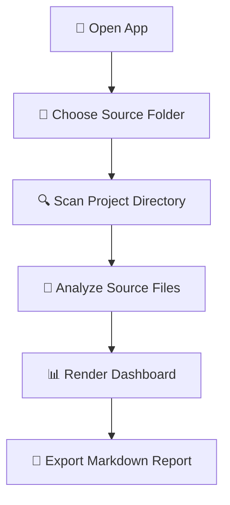
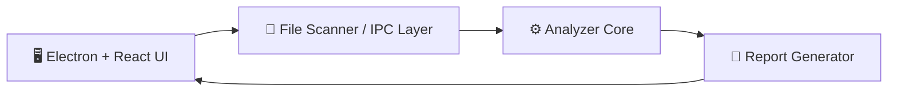
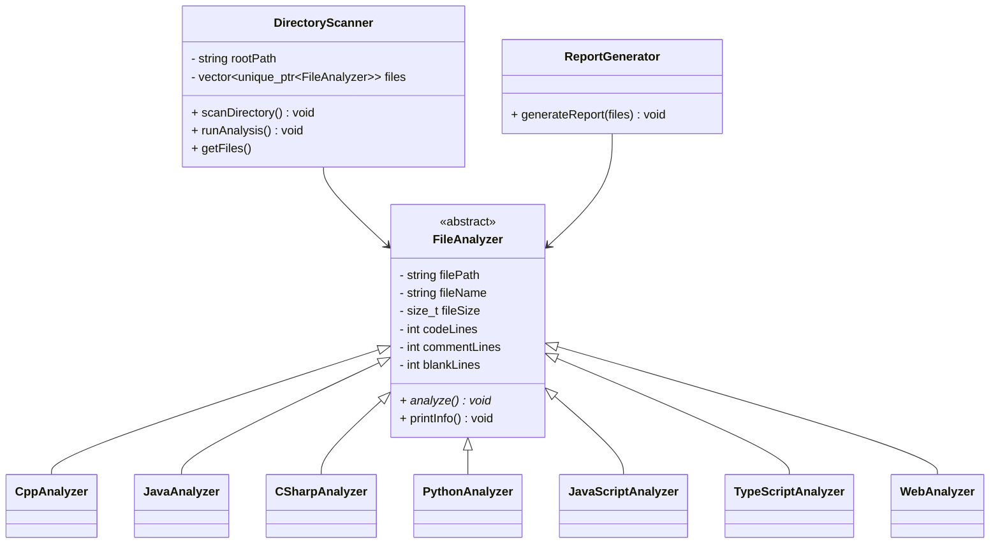

<div align="center">

# 🧠 Codebase Analyzer

### ⚡ Local Source Code Analysis Tool with Desktop UI & C++ OOP Core

<p>
  
  
  
  
  
</p>

<p>
  <b>Analyze local repositories, count real source lines, detect comments/blank lines, and visualize project structure through a clean desktop interface.</b>
</p>

</div>

---

## 📌 Overview

**Codebase Analyzer** is a local source code analysis application built for an Object-Oriented Programming project.

The project started as a **C++ CLI analyzer** and is now extended with a **desktop UI layer** to make the workflow easier to use, easier to demo, and more visually professional.

It helps users quickly understand:

- 📁 How many source files exist in a project
- 🧾 How many lines are actual code
- 💬 How many lines are comments
- ⬜ How many lines are blank
- 🌐 Which programming languages are used
- 📊 How the codebase is distributed across files and languages

---

## ✨ Key Features

| Feature | Description |
|---|---|
| 📂 **Local Folder Selection** | Users must choose a real local project folder before analysis starts |
| 🔍 **Recursive Directory Scan** | Traverse nested folders and detect valid source files automatically |
| 🚫 **Noise Folder Filtering** | Skip folders such as `.git`, `build`, `node_modules`, `dist`, and generated outputs |
| 🧠 **Language-aware Analysis** | Detect and analyze source files based on file extensions |
| 💬 **Comment Detection** | Count single-line and block comments depending on language syntax |
| 📊 **Dashboard UI** | Display project statistics through a clean desktop interface |
| 📝 **Markdown Report** | Export summarized analysis into `codebase_report.md` |
| 🧩 **OOP-based Core Design** | Apply abstraction, inheritance, polymorphism, and encapsulation in the analyzer core |

---

## 🖼️ Desktop UI Flow



> ✅ The app does **not** analyze a bundled sample by default.  
> Users must choose a real local folder before the analysis process begins.

---

## 🧱 Project Architecture



### 🧠 Core OOP Design



---

## 🧩 OOP Principles Applied

| OOP Principle | How it is applied |
|---|---|
| 🧊 **Abstraction** | `FileAnalyzer` defines a common interface for all file analyzers |
| 🧬 **Inheritance** | Specific analyzers inherit from `FileAnalyzer` |
| 🔁 **Polymorphism** | `analyze()` is overridden and called dynamically through base-class pointers |
| 🔒 **Encapsulation** | Each class owns one clear responsibility: scanning, analyzing, or reporting |
| 🧱 **Separation of Concerns** | UI, scanning, analysis, and report generation are separated into clear modules |

---

## 🌐 Supported Source Types

| Language / Platform | Extensions |
|---|---|
| ⚙️ C / C++ | `.c`, `.cpp`, `.h`, `.hpp` |
| ☕ Java | `.java` |
| 🟣 C# | `.cs` |
| 🐍 Python | `.py` |
| 🟨 JavaScript | `.js`, `.jsx`, `.mjs`, `.cjs` |
| 🔷 TypeScript | `.ts`, `.tsx`, `.mts`, `.cts` |
| 🌐 Web Frontend | `.html`, `.css` |

> 📌 Non-source files such as `.md`, `.json`, `.yml`, `.png`, and generated build files are treated as project metadata or ignored by the analyzer.

---

## 🛠️ Tech Stack

### ⚙️ Core

- 🚀 **C++23**
- 🧱 **CMake 3.20+**
- 📁 `std::filesystem`
- 🧠 Smart pointers: `std::unique_ptr`
- 📦 STL containers: `std::vector`, `std::map`, `std::string`

### 🖥️ Desktop UI

- ⚡ **Electron**
- ⚛️ **React**
- 🔷 **TypeScript**
- 🎨 **Tailwind CSS**
- 📦 **Vite**

### 🤖 Automation

- 🧪 GitHub Actions build workflow
- 📦 Cross-platform artifact generation for Windows, Linux, and macOS

---

## 📁 Repository Structure

```txt
Codebase-Analyzer/
├── include/                  # C++ header files
│   ├── FileAnalyzer.hpp
│   ├── DirectoryScanner.hpp
│   └── ReportGenerator.hpp
│
├── src/                      # C++ analyzer core
│   ├── main.cpp
│   ├── DirectoryScanner.cpp
│   ├── CppAnalyzer.cpp
│   ├── PythonAnalyzer.cpp
│   ├── JavaScriptAnalyzer.cpp
│   ├── TypeScriptAnalyzer.cpp
│   └── ReportGenerator.cpp
│
├── ui_design/                # Desktop UI source
│   ├── electron/             # Electron main process
│   ├── src/                  # React + TypeScript frontend
│   ├── package.json
│   └── vite.config.ts
│
├── CMakeLists.txt            # C++ build configuration
├── README.md                 # Project documentation
└── codebase_report.md        # Generated report output
```

---

## 🚀 Getting Started

### ✅ Requirements

Make sure these tools are installed:

- 🧩 **Git**
- ⚙️ **CMake 3.20+**
- 🧠 A C++ compiler with C++23 support
- 📦 **Node.js + npm**
- 🖥️ Windows, Linux, or macOS

---

## ⚙️ Build C++ CLI Core

```bash
git clone https://github.com/ThanhNguyn/Codebase-Analyzer.git
cd Codebase-Analyzer

cmake -S . -B build
cmake --build build
```

Run the analyzer:

```bash
./build/codebase-analyzer .
```

On Windows, the executable path may be:

```powershell
.\build\Debug\codebase-analyzer.exe .
```

---

## 🖥️ Run Desktop UI in Development

```bash
cd ui_design
npm install
npm run dev
```

The desktop app will open and ask the user to choose a local project folder.

---

## 📦 Build Desktop Release

```bash
cd ui_design
npm run build
npm run dist
```

Release files will be generated inside:

```txt
ui_design/release/
```

---

## 📊 Example Report Output

```md
# Codebase Analysis Report

## Summary

- Total files: 17
- Total lines: 882
- Code lines: 716
- Comment lines: 17
- Blank lines: 149
```

---

## 🧪 Testing Notes

The project was primarily tested on **Windows**.

Linux and macOS builds can be generated through GitHub Actions, but full runtime verification should be performed on real machines when available.

---

## 🗺️ Roadmap

- [x] ✅ C++ CLI analyzer core
- [x] ✅ Recursive directory scanner
- [x] ✅ Markdown report generation
- [x] ✅ Desktop UI prototype
- [x] ✅ Local folder selection flow
- [x] ✅ Windows desktop build
- [ ] 🔜 Connect UI directly to C++ analyzer executable
- [ ] 🔜 Add PDF / HTML report export
- [ ] 🔜 Add charts for language distribution
- [ ] 🔜 Add more language analyzers
- [ ] 🔜 Add deeper GitHub Actions smoke tests

---

## 🎓 Project Context

This project was developed as part of an **Object-Oriented Programming course project**.

The main academic goal is to demonstrate:

- 🧠 Object-oriented design
- 🧬 Class inheritance
- 🔁 Runtime polymorphism
- 🔒 Encapsulation
- 🧩 Maintainable software architecture
- 🖥️ Practical UI integration for a local analysis tool

---

## 👨‍💻 Author

**Nguyễn Tuấn Thành**  
Student ID: `25112107`  
Team: **404 Team Not Found**

---

## 📜 License

This project is intended for academic and educational purposes.

---

<div align="center">

### ⭐ If this project is useful, consider giving it a star!

**Made with 💙 C++23, Electron, React, TypeScript, and OOP design.**

</div>
