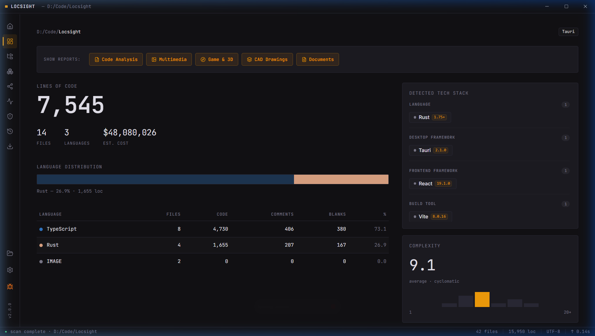

<p align="center">
  
</p>

<h1 align="center">Locsight</h1>

<p align="center">
  <strong>See through your source code.</strong>
</p>

<p align="center">
  <a href="https://github.com/ThanhNguyxnOrg/Locsight/releases"></a>
  <a href="https://github.com/ThanhNguyxnOrg/Locsight/actions"></a>
  <a href="https://github.com/ThanhNguyxnOrg/Locsight/blob/main/LICENSE"></a>
  
  <!-- STAT_LANGS_BADGE --><!-- /STAT_LANGS_BADGE -->
  
</p>

---

A blazing-fast ⚡ desktop app that scans, visualizes, and grades your codebase in seconds. Built with **Rust** and **Tauri v2** for native speed. Supports **<!-- STAT_LANGS_COUNT -->546+<!-- /STAT_LANGS_COUNT --> programming languages**.

## ✨ Highlights

| 🔍 Feature | Description |
|:---|:---|
| 📊 **Dashboard** | LOC, language distribution, complexity histograms, COCOMO cost estimation |
| 🫀 **Health Score** | DRYness, comment density, semantic role breakdown with letter grading (A+ → F) |
| 📦 **Asset Intelligence** | Scans, classifies, and estimates savings for Multimedia (image/video/audio), 3D/Game assets, and CAD drawing dependencies |
| 🔐 **Secrets Scanner** | Detects exposed AWS keys, GitHub tokens, JWT, private keys — auto-masked |
| 📝 **Annotations** | Searchable TODO / FIXME / HACK / BUG tracker with filters |
| 💡 **Insights** | Analyzes code issues, security bugs, and refactoring recommendations |
| 🔥 **Git Hotspots** | Finds high-risk files where complexity × churn is dangerous |
| 🌳 **Treemap** | Interactive squarified treemap sized by LOC |
| 🕸️ **Dep Graph** | Circular module coupling graph with zoom, search, and filters |
| 📁 **<!-- STAT_LANGS_COUNT -->546+<!-- /STAT_LANGS_COUNT --> Languages** | From Rust to COBOL, Solidity to GDScript — with shebang detection |
| 📄 **Export** | JSON · CSV · Markdown · HTML reports |

## 🚀 Quick Start

Locsight is a pre-compiled desktop app. **You do not need to clone the code or install Node.js/Rust to use it.**

1. Download the installer for your operating system from [Releases](https://github.com/ThanhNguyxnOrg/Locsight/releases).
2. Install and launch:
   - **Windows**: Run the `.msi` or `.exe` installer.
   - **macOS**: Drag the `.dmg` application to your `/Applications` directory.
   - **Linux**: Install the `.deb` package or execute the `.AppImage`.

> 💡 For detailed setup guides, security bypass instructions (SmartScreen/Gatekeeper), system dependency packages, and graphics hardware troubleshooting for **Virtual Machines (blank screen fix)**, please consult the [Full Installation Guide](docs/INSTALLATION.md).

## 🛠️ Development Setup

If you want to compile Locsight from source:

```bash
# 1. Clone repository
git clone https://github.com/ThanhNguyxnOrg/Locsight.git
cd Locsight

# 2. Install dependencies
npm install

# 3. Launch dev environment
npm run tauri dev
```

> 📋 **Prerequisites**: [Node.js](https://nodejs.org/) (v18+), [Rust](https://rustup.rs/) (v1.75+), and [Tauri v2 prerequisites](https://v2.tauri.app/start/prerequisites/) for compilation.

## ⚙️ Tech Stack

```
Backend   →  Rust · Tauri v2 · Rayon · WalkDir · SHA-256 · Regex
Frontend  →  React 19 · TypeScript · Vite · Tailwind CSS · Recharts
CI/CD     →  GitHub Actions · Dependabot · Auto-merge
```

## 📖 Documentation

| 📄 Document | Description |
|:---|:---|
| [🚀 Installation](docs/INSTALLATION.md) | Cross-platform setup, security bypass, and VM troubleshooting |
| [📐 Architecture](docs/ARCHITECTURE.md) | System design, module breakdown, data flow |
| [✨ Features](docs/FEATURES.md) | Detailed feature guide with examples |
| [💻 Development](docs/DEVELOPMENT.md) | Local setup, project structure, debugging |
| [🤝 Contributing](CONTRIBUTING.md) | How to contribute, code style, PR guidelines |
| [📋 Changelog](CHANGELOG.md) | Version history and release notes |
| [🔒 Security](SECURITY.md) | Vulnerability reporting policy |
| [📜 Code of Conduct](CODE_OF_CONDUCT.md) | Community standards |
| [⚖️ License](LICENSE) | MIT License |

## 📸 Screenshots & Navigation

<p align="center">
  
</p>

Locsight provides an intuitive, high-performance dark user interface tailored for instant codebase insights.

| Screen | Shortcut | Description |
|:---|:---:|:---|
| **🏠 Welcome** | `Ctrl/Cmd + 1` | Folder picker, recent project history, and custom `.locignore` rule preset setup |
| **📊 Dashboard** | `Ctrl/Cmd + 2` | High-level LOC overview, language distribution, complexity distribution histogram, and COCOMO II simulator |
| **📁 Files & Treemap** | `Ctrl/Cmd + 3` | Interactive directory tree and squarified treemap sized by physical code volume |
| **📦 Asset Intelligence** | `Ctrl/Cmd + 4` | Media (images, audio, video), 3D assets, CAD drawing tracking, SHA-256 duplicate detection, and orphan asset analysis |
| **🕸️ Dependency Graph** | `Ctrl/Cmd + 5` | Radial / cluster module coupling graph, cyclomatic instability ($I = C_e / (C_a + C_e)$), and circular dependency detection |
| **🫀 Health Score** | `Ctrl/Cmd + 6` | DRYness gauge (ULOC vs LOC), comment density, semantic role breakdown, and letter grading (A+ → F) |
| **🔐 Insights & Secrets** | `Ctrl/Cmd + 7` | Exposed secrets detection (AWS, GitHub, Google API, private keys) with Shannon entropy scoring, plus searchable TODO/FIXME annotations tracker |
| **🔥 Git Analytics** | `Ctrl/Cmd + 8` | Hotspot analysis ($Churn \times Complexity$), change coupling matrix, and author contribution breakdown |
| **📄 Export Center** | `Ctrl/Cmd + 9` | Generate comprehensive reports in **Markdown, JSON, CSV, and HTML** with granular category filters |
| **⚡ Open Folder** | `Ctrl/Cmd + Shift + O` | Quick project picker shortcut from any screen |

---

<p align="center">
  <sub>Made with 🦀 Rust + ⚛️ React by <a href="https://github.com/ThanhNguyxnOrg">ThanhNguyxn</a></sub>
</p>
