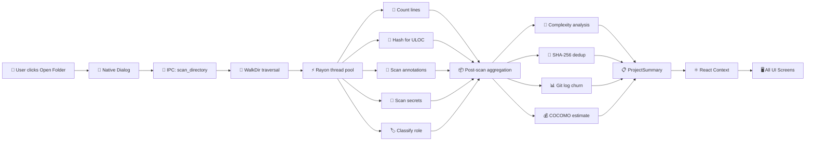
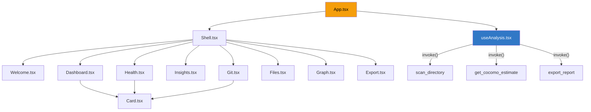
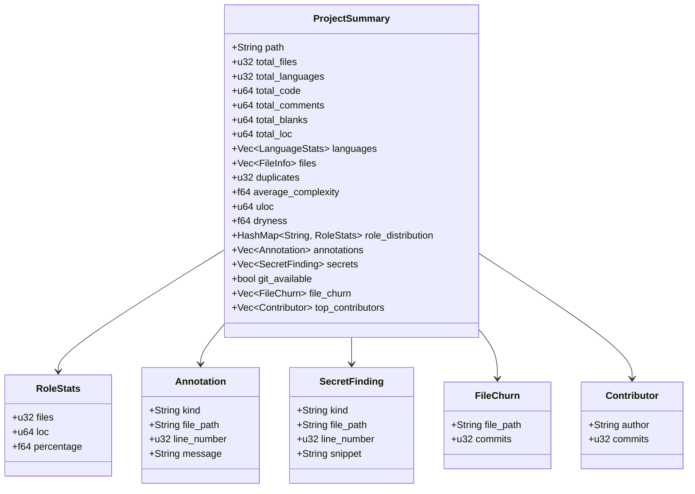

# 📐 Architecture

> System design overview for **Locsight** — a Rust + Tauri v2 codebase analyzer.

---

## 🏗️ High-Level Architecture

```mermaid
graph TB
    subgraph shell["🖥️ Tauri v2 Shell"]
        subgraph frontend["⚛️ React Frontend"]
            W["🏠 Welcome"]
            D["📊 Dashboard"]
            H["🫀 Health"]
            I["🔐 Insights"]
            G["🔥 Git"]
            F["📁 Files"]
            GR["🕸️ Graph"]
            E["📄 Export"]
        end

        subgraph backend["🦀 Rust Backend"]
            SC["🔍 Scanner Engine"]
            CX["🧮 Complexity"]
            UL["📏 ULOC / DRYness"]
            RL["🏷️ Roles Classifier"]
            AN["📝 Annotations"]
            SE["🔐 Secrets Scanner"]
            GI["📊 Git Churn"]
            CO["💰 COCOMO"]
            DU["🔁 Duplicate Finder"]
            CF["⚙️ Config Parser"]
        end

        frontend -- "IPC invoke()" --> backend
    end

    style shell fill:#1c1b22,stroke:#2a2935,color:#e8e6f0
    style frontend fill:#121114,stroke:#3178c6,color:#e8e6f0
    style backend fill:#121114,stroke:#dea584,color:#e8e6f0
```

---

## 🔄 Data Flow

---

## 📦 Module Breakdown

### 🦀 Rust Backend (`src-tauri/src/`)

| Module | File | Purpose |
|:---|:---|:---|
| 🔍 **Scanner** | `engine/scanner.rs` | Multi-threaded file walker with 250+ language support, shebang detection, and line counting |
| 🧮 **Complexity** | `engine/complexity.rs` | Cyclomatic complexity via keyword-based branching analysis |
| 💰 **COCOMO** | `engine/cocomo.rs` | COCOMO II cost/effort/schedule estimation |
| 🔁 **Duplicate** | `engine/duplicate.rs` | SHA-256 content hashing to detect identical files |
| 📏 **ULOC** | `engine/uloc.rs` | Unique Lines of Code via hash-set deduplication |
| 🏷️ **Roles** | `engine/roles.rs` | Semantic classification: Core / Test / Docs / Infra / Config / Scripts |
| 📝 **Annotations** | `engine/annotations.rs` | TODO / FIXME / HACK / BUG / DEPRECATED / XXX scanner |
| 🔐 **Secrets** | `engine/secrets.rs` | Credential leak detection (AWS, GitHub, Google, JWT, etc.) with entropy analysis |
| 📊 **Git** | `engine/git.rs` | Git log churn analysis, contributor extraction |
| ⚙️ **Config** | `engine/config.rs` | `.analyzer.json` custom rules parser |

### ⚛️ React Frontend (`src/`)

| Component | File | Purpose |
|:---|:---|:---|
| 🏠 **Welcome** | `components/Welcome.tsx` | Folder picker + recent projects |
| 📊 **Dashboard** | `components/Dashboard.tsx` | LOC overview, language bars, complexity, COCOMO |
| 🫀 **Health** | `components/Health.tsx` | DRYness gauge, comment density, semantic roles, health score |
| 🔐 **Insights** | `components/Insights.tsx` | Secrets alerts + searchable annotation browser |
| 🔥 **Git** | `components/Git.tsx` | Churn hotspots, contributor breakdown |
| 📁 **Files** | `components/Files.tsx` | File tree + squarified treemap |
| 🕸️ **Graph** | `components/Graph.tsx` | Circular dependency coupling graph |
| 📄 **Export** | `components/Export.tsx` | Multi-format report generator |

---

## 🧩 Component Relationships

---

## 🗄️ Key Data Structures

